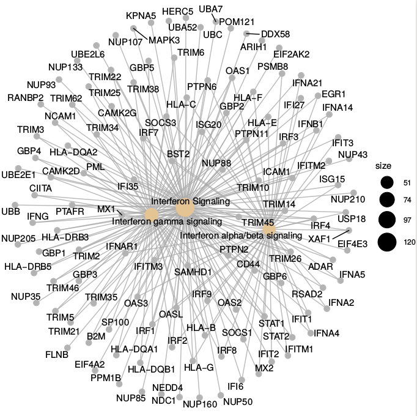

```{r setup, include=FALSE}
knitr::opts_chunk$set(echo = TRUE)
```

```{r, include=FALSE}
workingDir <-getwd()
source("StatisticalAnalysisMicroarrayData_PaulaBalcells.R")
dataDir <- file.path(workingDir, "dades")
```

## Abstract

Influenza virus can not only affect the respiratory system but also infect the central nervous system (CNS) by leading to CNS disorder and encephalopathy and encephalitis. Previous studies suggest that infected astrocytes can produce cytokines as well as induce apoptosis as a response. To study the comprehensive host responses to H5N1 infection in a human astrocyte cell line, U251 cells were infected by H5N1 at MOI 1 or were kept as control, and at time point 6, 12 and 24 hours, RNA transcripts from all 18 total replicates was extracted for microarray experiment. The aim of the original study "Insights into Human Astrocyte Response to H5N1 Infection by Microarray Analysis" (see __References__) in which this analysis is based was to statistically analyze which genes are differentially expressed likely due to the infection, in order to provide an insight into host responses to influenza virus in human astrocyte cells. 


## Objectives

The main objective of the original study is to characterize the comprehensive host responses to H5N1 infection in the human astrocyte cell line U251 by identifying the differential expressed genes in infected cells. 

In order to do an study of the microarray data of the original study, it is aimed to assess the quality of the data, obtain a normalized data set from which to extract results, perform multiple tests to assess the significant genes and provide the statistical results with a biological interpretation.


## Material and methods

### Data
The microarray experiment was performed on an Agilent platform, Agilent-014850 Whole Human Genome Microarray 4x44K G4112F (Probe Name version) (GPL6480). The raw data obtained from the experiment in text format is publicly available on the GEO database.

In total, 18 total samples were used as targets for the RNA microarray experiment, accounting for two main groups divided in time points with replicates. The two groups are infected with H5N1 and control cell samples. The three time points at which the RNA was extracted for each group are 6, 12 and 24 hours. There are three replicates per group and time point.

For each sample, the expression levels of 45015 genes were measured. The raw data, then, includes gene expression levels of 45015 for 18 samples. Also the background expression values are present in the raw data.

### Software

The microarray data analysis has been conducted using R statistical programming language in R in the RStudio development environment. 

Several Bioconductor packages have been used for the analysis and comprehension of the data: GEOquery, oligo, limma, Biobase, arrayQualityMetrics, genefilter, multtest, annotate, xtable, gplots, scatterplot3d, hgug4112a.db, ReactomePA. 

The raw data from the microarray experiment has been retrieved from GEO database using the GEOquery package. The limma package has allowed the reading of the Agilent raw data in text format and the assessment of differential expression using linear models. The arrayQualityMetrics has been used for the quality control of the data. The hgug4112a.db annotation package specific for the Agilent platform used has enabled the relation of human genes for annotation. The ReactomePA package has been used to provide an statistical approach for the biological interpretation of the results.

### Methods

The pipeline followed in the analysis consisted on the following steps: obtaining the raw data in text format, quality control of the raw data, filtering the control probes and the duplicated probes from the raw data, normalization of the raw data, building an expression set with the normalized data, quality control of the normalized data, filtering of the least variable genes,  defining the design matrix and the contrast matrix, linear model estimation, obtaining the differentially expressed genes, top differentially expressed genes annotation, extraction and visualization of the results, and performance of a basic enrichment analysis of pathways for biological interpretation of the results.

The first step in the analysis was to obtain the raw data from the microarray experiment. Agilent single-channel raw data was read using the limma package into an ElistRaw object, as no CEL files were available.

This quality control step included visualization and interpretation of the data using different approaches; a boxplot of the intensity of the raw data, hierarchical clustering of the samples based on the expressions and a Principal Component Analysis. The results of this control indicated that the normalization process could be done on the data.

The normalization process included three steps: background correction, normalization and summarization. Before the background correction, the control probes and the duplicated probes were removed from the set. Then, the background correction was done using the “normexp” method and the normalization between arrays was done using the “quantile” method. As the data was single-channel (one color) normalization within arrays was not needed. Both steps were done using limma package. To facilitate the analysis, an ExpressionSet object was build from the normalized data.

Another quality control was performed on the normalized data using the same approaches than before (boxplot, hierarchical clustering, PCA) and an additional analysis with the arrayQualityMetrics package. The least variable genes were removed from the expression set.

Before the estimation of the model for detecting the differential expressed genes, a design matrix and a contrast matrix were defined. The comparisons of interest for the analysis were those of the e  control group compared with the infected group at the different time points, three comparisons in total. Also, the infected group compared at the final stage (24h) with the initial stage(6h). The model was estimated with limma package, which uses Empirical Bayes models to estimate variability.

Using the estimated model, for each comparison the genes were ordered based on their significance, considering the genes with lowest p-value the most differentially expressed. The most significant genes were annotated using the Agilent annotation package hgug4112a.db. 

From the list of significant annotated genes, the EntrezID were obtained to perform an enrichment analysis for pathways included in the ReactomePA package.


## Results

### Gene expression alterations

The comparisons of gene expression profiles between U251 cells infected with H5N1 and controls revealed alterations of the RNA transcripts levels at the different time points.

There is a notable upregulation of 105 genes in infected cells at the time point 24 hours.For the comparison between stages of the infected cells, 300 genes are remarkably downregulated whereas 359 are upregulated.

```{r echo=FALSE}
require(limma)
res <- decideTests(fit.main, method="separate", adjust.method="fdr", p.value=0.1, lfc=1)
sum.res.rows <- apply(abs(res),1,sum)
res.selected <- res[sum.res.rows!=0,]
print(summary(res))
```

For the all the comparisons, the same top annotated genes were obtained, including with the lowest p-value, considered the most differentially expressed, the genes with gene names family with sequence similarity 174 member B, adaptor related protein complex 3 subunit sigma 2, synaptic vesicle glycoprotein 2B, RNA binding protein - mRNA processing factor 2, and apoptosis and caspase activation inhibitor.

```{r echo=FALSE}
knitr::kable(
  tta3, booktabs = TRUE, caption = "Annotated top table results for hm24vscon24 comparison"
)
```

A Venn diagram shows the overlapping of differential expressed genes at each time post-infection with FDR <0.1 and logFC > 1, with only 2 differential expressed genes shared in all comparisons, which could indicate that the differential expression is already found in the initial stages post-infection.

```{r echo=FALSE}
vennDiagram(res.selected[,1:3], cex=0.9) +
title("Genes in common between the three comparisons\n Genes selected with FDR < 0.1 and logFC > 1")
```

The volcano plot for the comparison between infected cells and control at 24 hours post-infection shows differential expression for the genes IFIT2 (Interferon-induced protein with tetratricopeptide repeats 2), IFIT3 (Interferon-induced protein with tetratricopeptide repeats 3) and IFIT5 (Interferon-induced protein with tetratricopeptide repeats 5), among others, which seems to indicate the role of interferon signaling pathways in the host response of U251 cells to H5N1 infection.

```{r showresults, echo=FALSE}
volcanoplot(fit.main, coef=3, highlight = 10, names=SYMBOLS, main=paste("Differentially expressed genes", colnames(cont.matrix)[3], sep="\n")) +
abline(v=c(-1,1))
```


### Pathway overrepresentation

Pathway over-representation analysis was performed using the ReactomePA tools. For the comparisons between the infected cells and the controls at time points 12 hours and 24 hours, the pathways Interferon alpha/beta signaling, Interferon Signaling and Interferon gamma signaling were enriched.




```{r echo=FALSE}
knitr::kable(Tab.react.12.short, booktabs=TRUE,caption="First rows and columns for Reactome results on hm12vscon12 comparison")
```

```{r echo=FALSE}
knitr::kable(Tab.react.short, booktabs=TRUE,caption="First rows and columns for Reactome results on hm24vscon24 comparison")
```


## Discussion

The pathway enrichment analysis showed that the interferon signaling pathways was enriched in the infected U251 cells. Interferons exhibit important biologic activities including antiviral effects. This enrichment suggests than upon recognition of viral RNA, the host cells will initiate interferons signaling pathway as to activate a defense mechanism. 

At 6 hours time point after the infection, fewer genes were altered, in comparison with the 24 hours time point in which near 300 genes were down regulated and approximately 359 upregulated. This may indicate the influence of time pver response to influenza virus.

This results may provide a first insight to the response of astrocyte cells upon influenza infection, but the data should be more carefully manipulated and analyzed in order to be able to extract conclusions. Both in the raw and normalized data, many outliers can be observed that should be further analyzed. Although the data looks better after normalization, different methods for background correction and normalization step could be used for an improvement. Also, deletion of duplicated could be improved in order to take into account the average expression, for example. The Venn diagram with 0 shared genes for some of the comparisons may indicate some potential problems in the data treatment process.

The limitations of the small sample size should also be taken into account. More replicates per group would allow to increase the significance level of the resultant differential expressed genes, since the confidence on the results would increase.

However, the same analysis of the normalized data for the already processed and normalized data directly obtained from the GEO database (using the GEOquery package) leads to similar results, enriching interferon signaling pathways, but also relevant pathways not found here.


## Conclusions

Microarray data statistical analysis can provide a useful insight into biological conditions to be further researched; key genes identified can be a starting point for beyond functional analysis.

The microarray analysis explored here suggest an over-activation of interferon signaling for the global responses in human astrocytes (U251 cells) infected by H5N1. 

Moreover, genes related with regulated secretion in neural cells, RNA binding and protection against mediated cell death have been reported as differentially expressed in infected cells.


# References of the original study

Title: "Insights into responses of human astrocytes to H5N1 infection by transcriptional analysis"

GEO accession code: GSE66597

PubMed ID: 26008703

Status: Public on Jan 04, 2016

Contributors: Lin X, Wang R, Sun X, Zhang J, Jin M

Citation(s): Lin X, Wang R, Zhang J, Sun X et al. Insights into Human Astrocyte Response to H5N1 Infection by Microarray Analysis. Viruses 2015 May 22;7(5):2618-40. PMID: 26008703


# GitHub repository

https://github.com/balpaula/Balcells_Paula-OmicsTechniques

  
